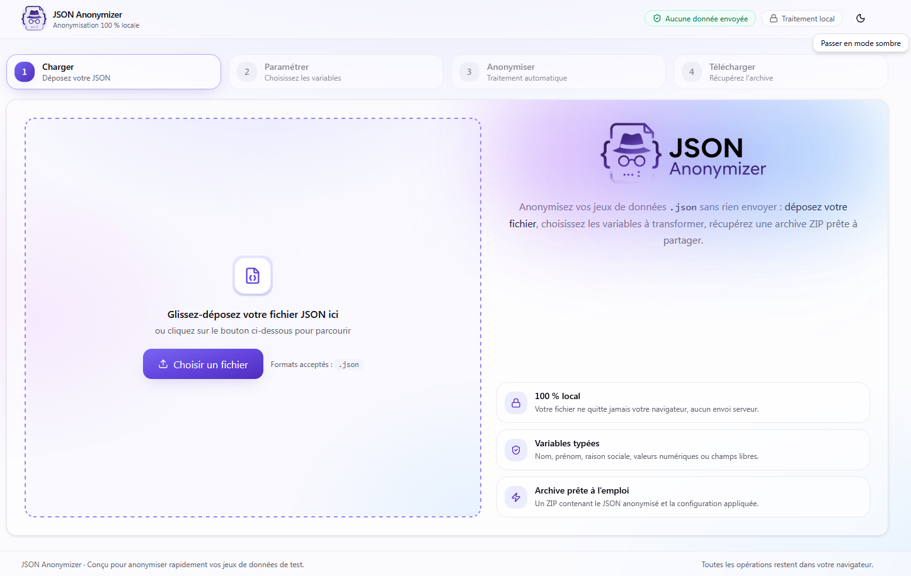

<div align="center">


# JSON Anonymizer

**Anonymisez vos fichiers JSON en quelques clics, sans jamais les envoyer nulle part.**

Tout le traitement se déroule **100 % dans votre navigateur** : aucune donnée ne quitte votre poste.

[**▶ Ouvrir l'application**](https://jlad75.github.io/JSON-Anonymizer/) · [Signaler un bug](https://github.com/JLAD75/JSON-Anonymizer/issues) · [Contribuer](#-contribuer)

[](LICENSE)
[](https://jlad75.github.io/JSON-Anonymizer/)


🌍 **[Read this in English →](README.en.md)**

<br />

<picture>
  <source media="(prefers-color-scheme: dark)" srcset="docs/screenshots/screenshot-dark.png" />
  <source media="(prefers-color-scheme: light)" srcset="docs/screenshots/screenshot-light.png" />
  
</picture>

</div>

---

## ✨ Pourquoi cet outil ?

Partager un jeu de données JSON pour un ticket de support, une démo, un test ou un dépôt public implique souvent d'y retirer les informations sensibles : noms, e-mails, raisons sociales, montants… Le faire à la main est fastidieux et risqué.

**JSON Anonymizer** automatise cela avec un assistant en 4 étapes. Il **détecte les champs**, **propose un type** pour chacun, **remplace les valeurs** par des données fictives crédibles, et vous rend une **archive ZIP** prête à partager — le tout sans serveur, sans compte, sans installation.

> 🔒 **Confidentialité par conception.** L'application est une page statique. Votre fichier est lu, analysé et transformé en mémoire, dans l'onglet du navigateur. Rien n'est téléversé, journalisé ou stocké ailleurs.

---

## 🎬 En un coup d'œil

L'assistant vous guide en **4 étapes** :

| Étape | Ce qui se passe |
| :---: | :--- |
| **1. Dépôt** | Glissez-déposez (ou sélectionnez) votre fichier `.json`. L'encodage est détecté automatiquement (UTF-8, UTF-16, Windows-1252/Latin-1). |
| **2. Paramétrage** | Les variables sont détectées et un type est suggéré pour chacune. Vous activez/désactivez l'anonymisation champ par champ, ajustez les types, fixez des bornes numériques… |
| **3. Traitement** | Les valeurs sélectionnées sont anonymisées en local. Une empreinte SHA‑256 du fichier sert de graine déterministe. |
| **4. Téléchargement** | Vous récupérez un ZIP contenant le JSON anonymisé **et** la configuration utilisée. Un comparateur avant/après est disponible. |

---

## 🧠 Comment ça marche

### Détection des variables

Le fichier est parcouru récursivement et chaque feuille est regroupée par **chemin générique** : les indices de tableaux sont réduits à `[]`. Ainsi, une liste de 10 000 lignes ne produit **qu'une seule variable par champ**.

```
client.factures[].montant     ← une variable, peu importe le nombre de factures
client.factures[].emetteur
responsable.email
```

Pour chaque variable, l'outil retient le type primitif détecté (texte, nombre, booléen, null, mixte), le nombre d'occurrences, quelques exemples de valeurs, et les bornes numériques observées (min/max).

### Suggestion automatique du type

Le type est deviné à partir du **nom du champ** (par ex. `prenom`, `raison_sociale`, `email`, `ville`, `nom_complet`…) et, à défaut, du **contenu** des exemples (une valeur qui ressemble à `Prénom Nom` ou à une adresse e-mail). Les booléens, identifiants (`id`, `uuid`…), statuts et dates sont laissés **désactivés par défaut**. Vous gardez toujours le dernier mot.

### Les stratégies d'anonymisation

| Type | Stratégie |
| :--- | :--- |
| **Numérique** | Génère un nombre du **même format** (mêmes signe, magnitude et nombre de décimales) mais différent. Des **bornes min/max** facultatives permettent de tirer la valeur dans une plage. |
| **Raison sociale** | Remplace par une raison sociale fictive tirée au hasard. |
| **Nom / Prénom** | Remplace par un nom / prénom fictif tiré au hasard. |
| **Nom et prénom** | Compose un « Prénom Nom » fictif en **préservant le séparateur** (espace, virgule, tiret) et la casse. |
| **E-mail** | Forge une adresse `prenom.nom@…` sur un **domaine réservé** (`.example`, `.test`, `.invalid` — RFC 2606 / 6761), donc jamais réelle. |
| **Ville** | Remplace par une autre commune francophone réelle (donnée publique, non personnelle), casse préservée. |
| **Autre** | Substitue **chaque caractère** par un autre du même type (lettre/chiffre), en conservant casse, espaces et ponctuation. Idéal pour téléphones, références, codes… |

La **casse** est respectée pour tous les types issus de listes : `PARIS → MARSEILLE`, `paris → marseille`, `Paris → Marseille`.

### Le mode « Autre » : déterministe et irréversible

Le type **Autre** mérite une explication, car c'est le cœur « cryptographique » de l'outil.

Au lancement, l'application calcule le **SHA‑256 du fichier source**. Cette empreinte sert de **graine** (*salt*) à un générateur pseudo-aléatoire (xmur3 + sfc32) qui pilote la substitution caractère par caractère. Conséquences :

- ♻️ **Cohérence intra-fichier** — deux occurrences d'une même valeur donnent toujours la même valeur anonymisée (`+33 6 12 34 56 78` → toujours le même résultat dans ce fichier).
- 🔁 **Reproductibilité** — relancer l'anonymisation sur le même fichier produit le même résultat.
- 🚫 **Irréversibilité** — sans l'empreinte du document d'origine, impossible de remonter à la valeur initiale. Le résultat n'est pas un simple anagramme (impossible de « re-trier » les caractères pour retrouver l'original).
- 🧩 **Silhouette préservée** — espaces et ponctuation restent en place : `+33 6 12 34 56 78` → `+87 4 91 03 27 65`.

> ⚠️ Les types issus de listes (nom, prénom, ville, e-mail…) et le type numérique utilisent un tirage **aléatoire à chaque exécution** : ils ne sont volontairement **pas** reproductibles, pour maximiser le brouillage.

### L'archive de sortie

Le ZIP téléchargé contient :

```
mon-fichier.anonymise.zip
├── mon-fichier.anonymise.json   ← votre JSON, anonymisé
├── mon-fichier.config.json      ← le paramétrage appliqué (type + on/off + bornes)
└── README.txt                   ← rappel du contenu
```

Le **fichier de configuration** est réimportable : déposez-le à l'étape 2 pour rejouer exactement le même paramétrage sur un nouveau fichier de structure identique.

---

## 🚀 Démarrage rapide

### Utiliser l'application en ligne

Rien à installer : **[jlad75.github.io/JSON-Anonymizer](https://jlad75.github.io/JSON-Anonymizer/)**.

### Lancer en local

> Prérequis : **Node.js 22+** et [**pnpm**](https://pnpm.io/) (l'outil utilise pnpm, mais npm/yarn fonctionnent aussi).

```bash
# 1. Cloner le dépôt
git clone https://github.com/JLAD75/JSON-Anonymizer.git
cd JSON-Anonymizer

# 2. Installer les dépendances
pnpm install

# 3. Démarrer le serveur de développement
pnpm dev
# → http://127.0.0.1:5173
```

### Scripts disponibles

| Commande | Description |
| :--- | :--- |
| `pnpm dev` | Serveur de développement avec rechargement à chaud. |
| `pnpm build` | Vérification des types (`tsc`) puis build de production. |
| `pnpm preview` | Sert le build de production en local (port 4173). |
| `pnpm lint` | Analyse statique avec ESLint. |
| `pnpm smoke` | Test de fumée Node qui rejoue les algorithmes d'anonymisation sur le jeu d'exemple. |

Un jeu de données d'exemple est fourni dans [`sample/jeu-de-test.json`](sample/jeu-de-test.json) pour essayer l'outil immédiatement.

---

## 🛠️ Pile technique

- **[React 19](https://react.dev/)** + **[TypeScript](https://www.typescriptlang.org/)** (mode strict)
- **[Vite](https://vite.dev/)** pour le build et le serveur de dev
- **[Tailwind CSS v4](https://tailwindcss.com/)** + composants **[shadcn/ui](https://ui.shadcn.com/)** sur **[Radix UI](https://www.radix-ui.com/)**
- **[Zustand](https://zustand-demo.pmnd.rs/)** pour l'état de l'assistant
- **[Framer Motion](https://www.framer.com/motion/)** pour les animations
- **[JSZip](https://stuk.github.io/jszip/)** + **[FileSaver](https://github.com/eligrey/FileSaver.js)** pour l'archive ZIP
- **[Web Crypto API](https://developer.mozilla.org/docs/Web/API/Web_Crypto_API)** (`crypto.subtle`) pour le SHA‑256

### Structure du projet

```
src/
├── components/
│   ├── wizard/        Étapes de l'assistant (Upload, Configure, Process, Download…)
│   └── ui/            Composants shadcn/ui (button, select, switch, tooltip…)
├── lib/
│   ├── anonymizer.ts    Cœur de l'anonymisation (PRNG seedé, stratégies par type)
│   ├── jsonAnalyzer.ts  Parcours du JSON, détection des variables et des types
│   ├── textDecoder.ts   Détection d'encodage (BOM, UTF-8 strict, repli Windows-1252)
│   ├── fakeData.ts      Jeux de données fictives (sociétés, noms, prénoms, villes…)
│   └── zipExporter.ts   Construction de l'archive ZIP
├── store/             État global (Zustand)
└── types/             Types partagés
```

---

## 🤝 Contribuer

**Les contributions sont les bienvenues — ce projet est ouvert à tous !** 🎉

Que vous corrigiez une coquille, amélioriez une heuristique de détection, enrichissiez les listes de données fictives ou ajoutiez une fonctionnalité, votre aide est appréciée.

1. **Forkez** le dépôt et créez une branche : `git checkout -b ma-super-amelioration`
2. Développez, puis vérifiez que tout passe :
   ```bash
   pnpm lint && pnpm build && pnpm smoke
   ```
3. Committez et poussez votre branche.
4. Ouvrez une **Pull Request** en décrivant votre changement.

Quelques pistes d'amélioration : nouveaux types de variables, internationalisation, détection plus fine des champs, formats d'export supplémentaires… N'hésitez pas à [ouvrir une issue](https://github.com/JLAD75/JSON-Anonymizer/issues) pour discuter d'une idée avant de vous lancer.

---

## 📄 Licence

Distribué sous licence **[MIT](LICENSE)**. Vous êtes libre de l'utiliser, le modifier et le redistribuer.

Copyright © 2026 Jonathan Latgé-Delaite.

---

<div align="center">

Fait avec ❤️ et beaucoup de souci pour votre vie privée.

🌍 **[Read this in English →](README.en.md)**

</div>
